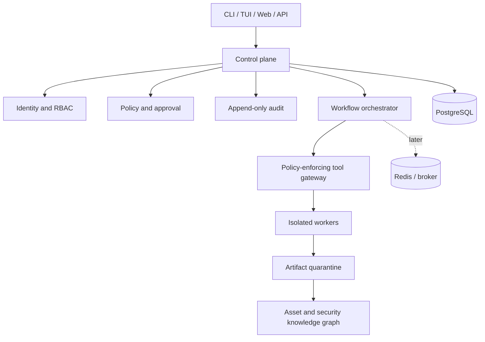
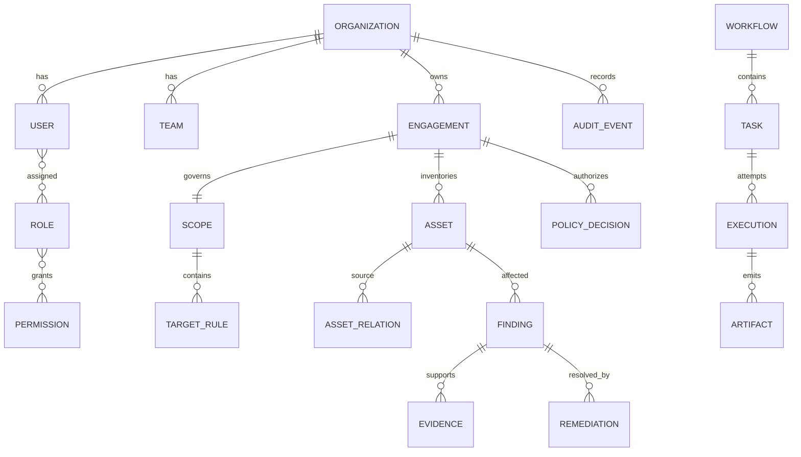

# AEGIS architecture

## CURRENT STATE

The initial repository contained only a GPL-3.0 license and a one-line README.
There was no application, packaging, architecture, dependency graph, or test
suite. This phase establishes the architectural contract and a first executable
policy kernel without pretending that later platform controls already exist.

## TARGET ARCHITECTURE

AEGIS begins as a modular monolith. Domain packages own their models and use
cases; adapters own HTTP, CLI, database, queue, and third-party integration.
Imports point inward and cross-domain changes travel through explicit services
or versioned events. PostgreSQL is initially the transactional source of truth.



### Components and responsibilities

| Domain | Responsibility | Must not do |
|---|---|---|
| `core` | config, IDs, events, lifecycle, ports | contain security-domain policy |
| `identity` | principals, organizations, teams, RBAC | grant execution directly |
| `engagements` | authorization context and lifecycle | evaluate targets |
| `scope` | normalize targets and decide scope membership | perform network I/O |
| `audit` | append-only, hash-linked decision/action records | silently mutate history |
| `workflow` | state machines, idempotency, retry, deadlines | bypass gateway |
| `plugins` | metadata, lifecycle, capability protocol | inherit host privilege |
| `assets` | typed asset graph and provenance | discover independently |
| `vulnerability` | findings, evidence, remediation, retest | execute validation directly |
| security modules | produce structured task proposals/results | access raw execution primitives |
| `reporting` / `intelligence` | projections and correlation | become systems of authorization |
| `range` | isolated disposable laboratories | bridge to production networks |

### Policy Engine

The Policy Engine composes independent, fail-closed checks: authenticated actor,
organization boundary, RBAC action, active engagement, mandatory scope, target
allowlist and exclusion, environment, kill switch, risk/approval, quota/rate
limit, and deadline. Exclusions always win. A decision contains normalized
inputs, policy version, reasons, correlation ID, and expiry. The first increment
implements the pure organization/engagement/scope portion. Later, an execution
capability token will be short-lived, audience-bound, one-operation-only, and
issued only after the complete decision is durably audited.

Network redirects, DNS resolution/rebinding, discovered targets, retries, and
plugin-generated subtasks are **new targets** and must be re-authorized. Only a
tool gateway holds worker credentials; plugins cannot call worker transports.

### Plugins

`AegisPlugin` is a narrow protocol with immutable metadata (name, version,
author, signed digest, permissions, capabilities, asset types, resources, risk)
and `initialize`, `execute`, and `shutdown`. Discovery uses an explicit registry,
not arbitrary filesystem import. Installation verifies signatures and an admin
grant. Execution starts out in restricted subprocess/container workers with a
read-only package, no inherited secrets, default-denied egress, resource limits,
and a structured IPC contract. The gateway validates every requested tool call;
plugin output remains untrusted and quarantined.

### Workers and workflows

Workflow state persists before dispatch. Tasks carry UUID, tenant, engagement,
correlation, idempotency key, deadline, risk class, resource envelope, and a
policy-token reference. Workers are capability-specific and disposable. They
heartbeat, honor cancellation, emit artifacts by content digest, and never
receive control-plane database credentials. Retry is bounded exponential backoff
with jitter; terminal failures enter a dead-letter state for reviewed replay.
Dramatiq is the preferred first distributed queue because its small actor model
fits extraction from the monolith; Celery remains an option if canvas/workflow
features prove necessary. The first implementation uses an in-process adapter so
correctness does not depend on a broker.

## SECURITY BOUNDARIES

1. **Untrusted client → API gateway:** validate schema, authenticate, rate-limit,
   attach tenant and correlation context; never trust client-supplied identity.
2. **Control plane → policy/tool gateway:** the sole active-operation choke point;
   durable decision and approval precede dispatch.
3. **Gateway → workers/plugins:** mutually authenticated structured messages,
   least-privilege capability tokens, network/filesystem/CPU/memory limits.
4. **Worker → target:** egress proxy revalidates destination after DNS and every
   redirect; environment routes prevent production/range crossover.
5. **Artifacts → control plane:** hostile content quarantine, size/type checks,
   digest/signature, safe rendering, no implicit parsing/execution.
6. **Tenant → tenant:** organization ID is derived from identity and enforced in
   application and database row-level policies.
7. **Operators → secrets/audit:** separate duties, MFA, envelope encryption, and
   append-only externally anchored audit digests.

## PROPOSED TREE

```text
src/aegis/
  core/ identity/ engagements/ scope/ audit/
  assets/ vulnerability/ workflow/ plugins/
  discovery/ code_security/ web_security/ api_security/
  cloud_security/ container_security/ crypto/ intelligence/
  reporting/ range/ agents/
  adapters/{api,cli,database,queue,telemetry}/
tests/{unit,integration,security,property,contract,e2e}/
docs/adr/  migrations/  deploy/  scripts/
```

Directories are added only with working behavior; this is a destination map, not
a request for empty scaffolding.

## DATA MODEL

All mutable aggregate roots use UUIDv7 when support is standardized (UUIDv4 in
the bootstrap), UTC timestamps, optimistic version, `created_by`, tenant, and
correlation ID. Secret material is referenced, never stored in clear text.



Key invariants: scope belongs to exactly one engagement; assets and findings
retain provenance; executions reference the exact policy decision; evidence is
content-addressed; audit events are append-only and hash-linked; relationships
cannot cross tenants. `TargetRule` is typed (domain, IP, CIDR, repository, cloud
resource), normalized, explicitly allow/exclude, and temporally bounded.

## Dependencies proposed

| Choice | Reason / adoption point |
|---|---|
| FastAPI + Pydantic v2 | typed boundary/OpenAPI in Phase 1 |
| SQLAlchemy 2 + Alembic + asyncpg | explicit persistence and migrations |
| PostgreSQL | transactions, JSONB, RLS, graph projections, audit durability |
| Typer + Rich | maintainable operator CLI after bootstrap |
| httpx | async outbound calls through a hardened transport/gateway only |
| Dramatiq + Redis | simple distributed workers in Phase 4, not before |
| OpenTelemetry + Prometheus | vendor-neutral traces and operational metrics |
| structlog | context-bound JSON logs with redaction |
| cryptography | vetted envelope encryption/signatures; no custom crypto |
| pytest, Hypothesis, Ruff, mypy | behavior, invariants, linting, strict types |

Dependencies are introduced at the increment that uses them and pinned by a
generated lock file. PDF/vector search/Kubernetes SDKs remain optional adapters.

## IMPLEMENTATION PLAN

Ten independently valuable increments:

1. Architecture contract plus executable pure scope kernel and bootstrap CLI.
2. Typed settings, structured logging, correlation middleware, health/readiness.
3. Async database foundation, migrations, organizations/users/engagements.
4. Authentication, service accounts, RBAC permission matrix, tenant isolation.
5. Append-only hash-linked audit writer and policy-decision persistence.
6. Complete policy composition: kill switch, approvals, quotas, rate limits.
7. Tool gateway with expiring capability tokens and non-bypass contract tests.
8. Asset graph CRUD/import with provenance and tenant-safe search.
9. Durable in-process workflow state machine, cancellation, retry/idempotency.
10. First isolated passive analysis plugin and quarantined artifact path.

Each increment follows PLAN → IMPLEMENTATION → TESTS → SECURITY REVIEW → RESULT
→ NEXT STEP, and adds no active scanner before increment 7 passes its security
and bypass tests.

## Observability and tests

JSON logs and spans share correlation, tenant, engagement, workflow, task,
execution, decision, and actor identifiers; secrets and artifact bodies are
redacted. Metrics cover decisions/denials, queue latency, task duration/retries,
worker resources, audit failures, and kill-switch state. Health is liveness only;
readiness verifies mandatory dependencies and policy/audit availability. Audit
records, not ordinary logs, reconstruct security-sensitive activity.

Tests are layered: pure unit tests; Hypothesis normalization/CIDR/tenant
properties; policy bypass and SSRF/DNS-rebinding security tests; API/plugin/event
contract tests; PostgreSQL/queue integration tests; isolated range E2E tests.
Architecture tests forbid security modules from importing worker/network
adapters, and mutation tests target every deny rule. CI gates format, lint, strict
types, unit/security/dependency/integration tests, build, SBOM, provenance, and
signing; critical findings fail closed with time-bound documented exceptions.

## RISKS

| Risk | Treatment |
|---|---|
| Policy bypass through alternate adapter | one gateway, import rules, capability credentials, contract tests |
| DNS rebinding/redirect SSRF | resolve through egress proxy, validate every hop and resolved IP |
| Compromised plugin/worker | isolation, no secrets, denied egress, signed packages, resource limits |
| Audit deletion/tampering | append-only store, hash chain, external digest anchor and alerts |
| Tenant data leakage | derived tenant context, RLS, composite keys, adversarial tests |
| Approval confused deputy | bind approver, exact action/target/digest, expiry, separation of duties |
| Queue replay/race | idempotency keys, atomic state transitions, expiring single-use tokens |
| Over-designed early platform | modular monolith, ports only at real boundaries, incremental dependencies |

## FIRST INCREMENT

**PLAN:** codify boundaries and provide the smallest policy behavior worth
testing. **IMPLEMENTATION:** package metadata, bootstrap CLI, immutable common
types, and an async deny-by-default domain/IP/CIDR scope evaluator with exclusion
precedence. **TESTS:** unit cases cover missing scope, wildcard semantics,
explicit exclusions, public/non-allowlisted targets, and cross-organization
actors. **SECURITY REVIEW:** no network or process primitive exists; the CLI is a
pure demonstration, strict CIDRs reject ambiguous host-bit ranges, and malformed
targets fail rather than broaden scope. **RESULT:** Phase 0 has executable proof
of its primary invariant, while clearly documenting incomplete controls.
**NEXT STEP:** increment 2—typed configuration and observable API lifecycle.
